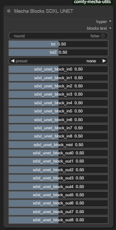

# comfy-mecha-utils

[comfy-mecha](https://github.com/ljleb/comfy-mecha.git)用の便利ノード

## Nodes
### Block Sliders

- 各ブロックの値をスライダーで入力
- プリセットは[sdweb-merge-block-weighted-gui](https://github.com/bbc-mc/sdweb-merge-block-weighted-gui.git)を参考にしています
- [sd-mecha](https://github.com/ljleb/sd-mecha.git)のアーキテクチャ(e.g. sd1, sdxl...)、コンポーネント(e.g. text, unet...)ごとに動的に作成されます
- 対象でないコンポーネント(画像でいうtext等)は`default hyper`として出力されます
- `round = True`で小数点第3位で四捨五入されて出力されます(スライダーの表示数値と一致)

### Blocks Updater
- 各入力hyperが`Dict`なら、それらを`update`します
- unetとteを同時にブロックマージしたい奇特な方へ