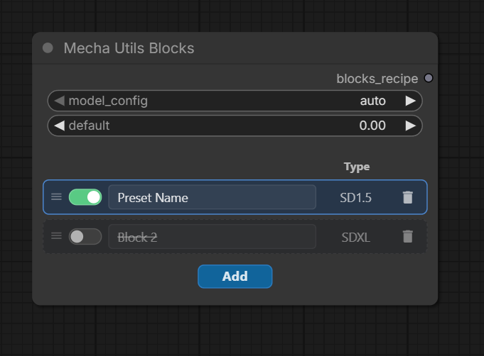
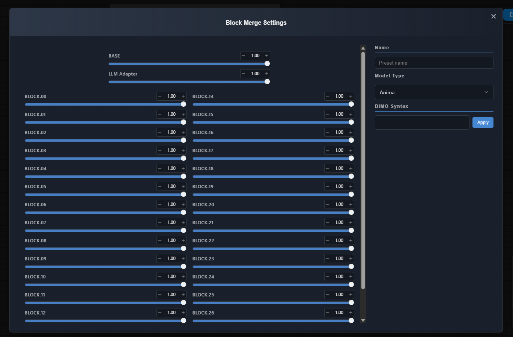
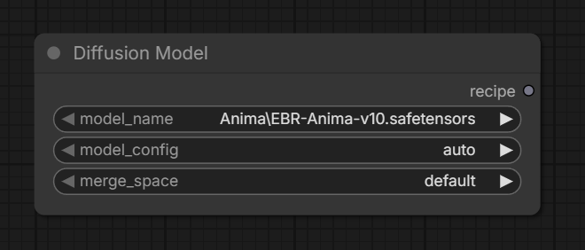
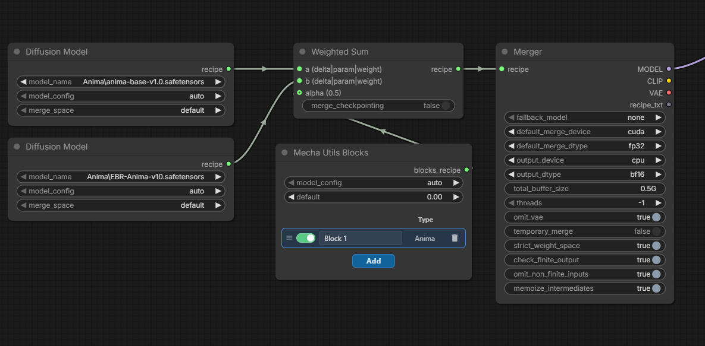

# comfy-mecha-utils

[comfy-mecha](https://github.com/ljleb/comfy-mecha) を ComfyUI で使いやすくするための補助ノード集です。

ブロック単位のマージ比率を作るノードと、`diffusion_models` / `text_encoders` フォルダ専用の mecha モデルローダーを追加します。

## Requirements

- ComfyUI
- comfy-mecha
- sd-mecha

## Nodes

### Mecha Utils Blocks

`WeightedSum` などの `alpha` 入力に接続するための `MECHA_RECIPE` を作成します。

ブロックごとの値をGUIで編集し、選択したModelTypeに応じて comfy-mecha / sd-mecha の実キーへ展開します。

主な用途:

- `WeightedSum` の `alpha` としてブロック別のマージ比率を指定する
- SD1.5 / SDXL / Anima のブロックをGUIで調整する
- 複数の設定行を保存し、必要な行を切り替える
- セパレータ行で設定を整理する

#### default

`default` は、どのブロック指定にも一致しなかったキーに使う値です。

例:

- `default = 0.0`: 指定したブロックだけマージ先モデルへ寄せ、それ以外は元モデルを維持
- `default = 1.0`: 指定していない部分はマージ先モデルを使い、指定ブロックだけ別比率にする

#### model_config

`model_config` は `auto` を選べます。

`auto` の場合、アクティブな設定行のModelTypeから以下のように推定します。

| ModelType | model_config |
| --- | --- |
| SD1.5 | `sd1-ldm` |
| SDXL | `sdxl-sgm` |
| Anima | `anima-comfyui` |

モデル本体を入力として受け取るノードではないため、ファイル内容からの完全な自動判定ではありません。

### Diffusion Model

`models/diffusion_models` にある `.safetensors` を comfy-mecha の `MECHA_RECIPE` として読み込むローダーです。

既存の comfy-mecha の `Model` ノードは `checkpoints` フォルダ向け、`ModelAny` は複数フォルダを横断するため、diffusion model だけを選びたい場合に使います。

入力:

- `model_name`: `diffusion_models` 内の `.safetensors`
- `model_config`: `auto` または sd-mecha のbase model config
- `merge_space`: 通常は `default`

### Text Encoder

`models/text_encoders` にある `.safetensors` を comfy-mecha の `MECHA_RECIPE` として読み込むローダーです。

Diffusion Model と同じく、対象フォルダを `text_encoders` に限定したローダーです。

入力:

- `model_name`: `text_encoders` 内の `.safetensors`
- `model_config`: `auto` または sd-mecha のbase model config
- `merge_space`: 通常は `default`

## Anima model_config

この拡張は `anima-comfyui` model_config を sd-mecha に登録します。

Anima用のdiffusion modelキーを登録しています。

## Sample

接続例

## Notes

- この拡張の出力は comfy-mecha の `MECHA_RECIPE` です。
- 実際のマージとComfyUIモデル化は comfy-mecha の `Merger` ノードで行います。
- `Diffusion Model` / `Text Encoder` はフォルダを絞るためのローダーです。キー変換やマージ処理自体は sd-mecha / comfy-mecha に従います。
